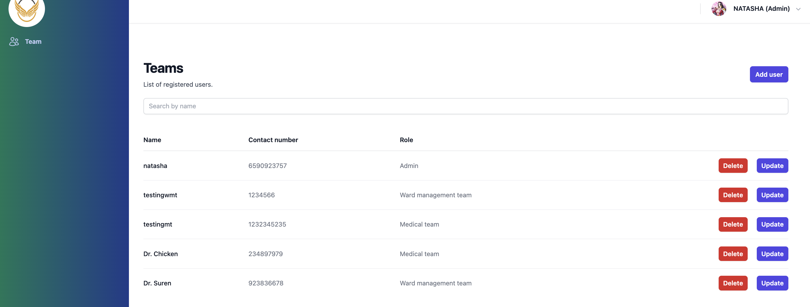
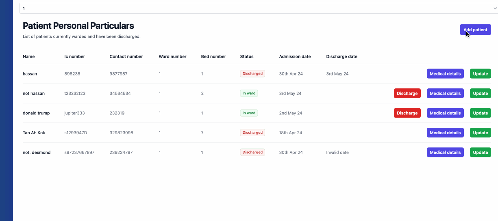

# Title: PernPuff (Ward Management System)

This app is designed with one thing in mind - effortless management of a patient's registration, admission and discharge, medical information in a hospital.
 

#

There are three main users of this application. Each user has a specific role and cannot access information that is not relevant to their role.
 

Role - Admin
 
Task - Create and maintain users.
 
 
User 2 - Ward Management Team
 
Task - Register patients, assign them to a ward and bed, and discharge them.
 
 
User 3 - Medical Team
 
Task - Update patient's medical information.

#

 
 

# Screenshots

### Here are some screenshots to demonstrate the basis of the app.

Landing Page

List of registered users

Adding and update patient's personal details

# Main Technologies Used

- Postgresql
- Express
- React JS
- Node JS
- TailwindCSS
   
   

# Dependencies

## Backend

- bcrypt
- body-parser
- cors
- dotenv
- express
- jsonwebtoken
- nodemon
- pg

#

## Frontend

- dotenv
- moment
- react
- react-dom
- react-router-dom

#

 

# Next Steps

- Adding of more data in users, patient personal particulars and patient medical details

- Adding of randomized inspirational quotes or positive healthcare news to be displayed every minute or so. Perhaps fetched from an API somewhere.
- When security has been implemented well, perhaps there could be a user who has access to everything and anything.
- A system to track every single activity from every employee (e.g updates - by Dr. Koh)

#
